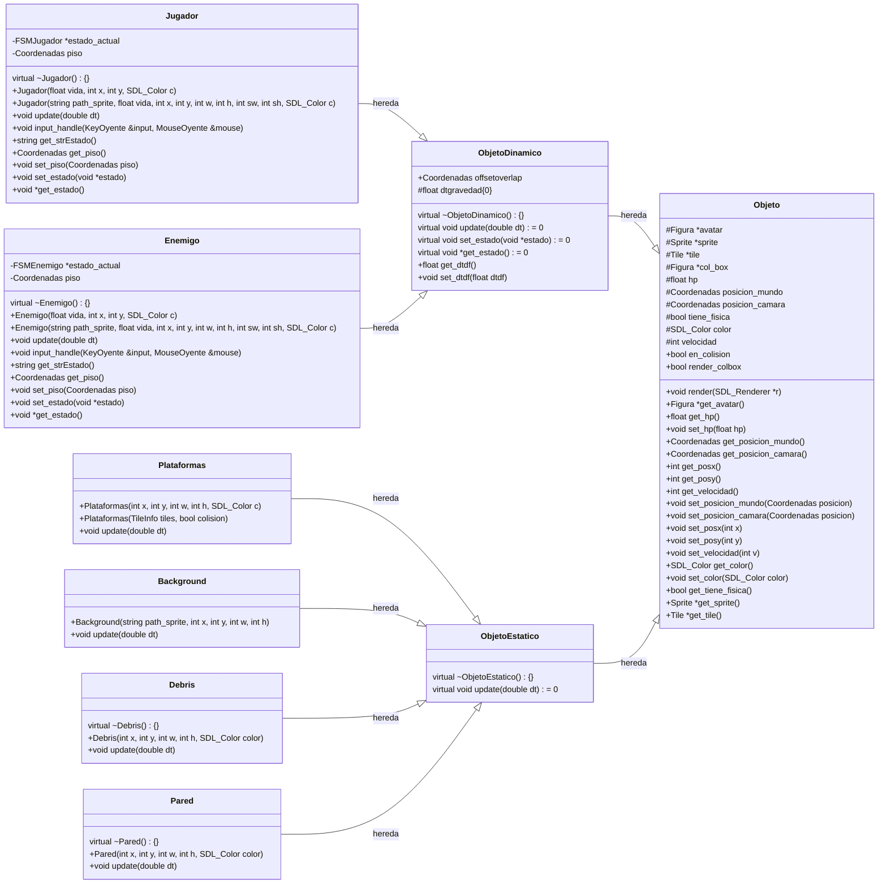

# Diseño de clases

```mermaid
classDiagram
direction LR

class Objeto
Objeto: #Figura *avatar
Objeto: #Sprite *sprite
Objeto: #Tile *tile
Objeto: #Figura *col_box
Objeto: #float hp
Objeto: #Coordenadas posicion_mundo
Objeto: #Coordenadas posicion_camara
Objeto: #bool tiene_fisica
Objeto: #SDL_Color color
Objeto: #int velocidad
Objeto: +bool en_colision
Objeto: +bool render_colbox
Objeto: +void render(SDL_Renderer *r)
Objeto: +Figura *get_avatar()
Objeto: +float get_hp()
Objeto: +void set_hp(float hp)
Objeto: +Coordenadas get_posicion_mundo()
Objeto: +Coordenadas get_posicion_camara()
Objeto: +int get_posx()
Objeto: +int get_posy()
Objeto: +int get_velocidad()
Objeto: +void set_posicion_mundo(Coordenadas posicion)
Objeto: +void set_posicion_camara(Coordenadas posicion)
Objeto: +void set_posx(int x)
Objeto: +void set_posy(int y)
Objeto: +void set_velocidad(int v)
Objeto: +SDL_Color get_color()
Objeto: +void set_color(SDL_Color color)
Objeto: +bool get_tiene_fisica()
Objeto: +Sprite *get_sprite()
Objeto: +Tile *get_tile()

class ObjetoDinamico
ObjetoDinamico --|> Objeto: hereda
ObjetoDinamico: virtual ~ObjetoDinamico(){}
ObjetoDinamico: virtual void update(double dt) = 0
ObjetoDinamico: virtual void set_estado(void *estado) = 0
ObjetoDinamico: virtual void *get_estado() = 0
ObjetoDinamico: +float get_dtdf()
ObjetoDinamico: +void set_dtdf(float dtdf)
ObjetoDinamico: +Coordenadas offsetoverlap
ObjetoDinamico: #float dtgravedad{0}

class ObjetoEstatico
ObjetoEstatico --|> Objeto: hereda
ObjetoEstatico: virtual ~ObjetoEstatico(){}
ObjetoEstatico: virtual void update(double dt) = 0

class Plataformas
Plataformas --|> ObjetoEstatico: hereda
Plataformas: +Plataformas(int x, int y, int w, int h, SDL_Color c)
Plataformas: +Plataformas(TileInfo tiles, bool colision)
Plataformas: +void update(double dt)

class Background
Background --|> ObjetoEstatico: hereda
Background: +Background(string path_sprite, int x, int y, int w, int h)
Background: +void update(double dt)

class Jugador
Jugador --|> ObjetoDinamico: hereda
Jugador: virtual ~Jugador(){}
Jugador: +Jugador(float vida, int x, int y, SDL_Color c)
Jugador: +Jugador(string path_sprite, float vida, int x, int y, int w, int h, int sw, int sh, SDL_Color c)
Jugador: +void update(double dt)
Jugador: +void input_handle(KeyOyente &input, MouseOyente &mouse)
Jugador: +string get_strEstado()
Jugador: +Coordenadas get_piso()
Jugador: +void set_piso(Coordenadas piso)
Jugador: +void set_estado(void *estado)
Jugador: +void *get_estado()
Jugador: -FSMJugador *estado_actual
Jugador: -Coordenadas piso

class Enemigo
Enemigo --|> ObjetoDinamico: hereda
Enemigo: virtual ~Enemigo(){}
Enemigo: +Enemigo(float vida, int x, int y, SDL_Color c)
Enemigo: +Enemigo(string path_sprite, float vida, int x, int y, int w, int h, int sw, int sh, SDL_Color c)
Enemigo: +void update(double dt)
Enemigo: +void input_handle(KeyOyente &input, MouseOyente &mouse)
Enemigo: +string get_strEstado()
Enemigo: +Coordenadas get_piso()
Enemigo: +void set_piso(Coordenadas piso)
Enemigo: +void set_estado(void *estado)
Enemigo: +void *get_estado()
Enemigo: -FSMEnemigo *estado_actual
Enemigo: -Coordenadas piso

class Debris
Debris --|> ObjetoEstatico: hereda
Debris: virtual ~Debris(){}
Debris: +Debris(int x, int y, int w, int h, SDL_Color color)
Debris: +void update(double dt)

class Pared
Pared --|> ObjetoEstatico: hereda
Pared: virtual ~Pared(){}
Pared: +Pared(int x, int y, int w, int h, SDL_Color color)
Pared: +void update(double dt)


```
